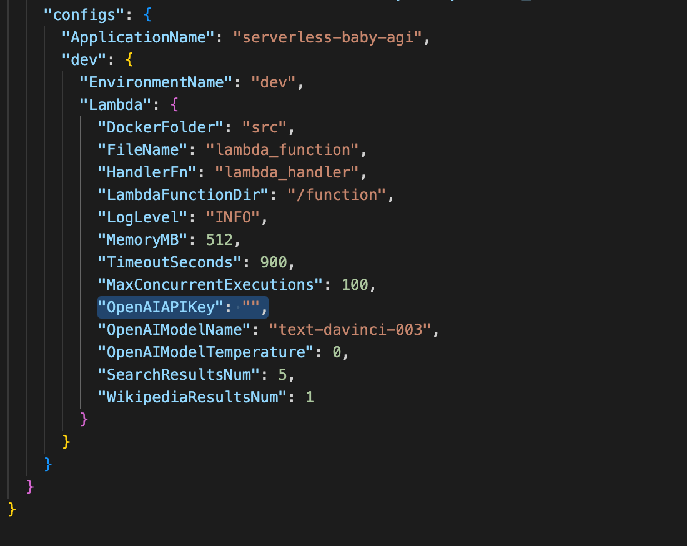
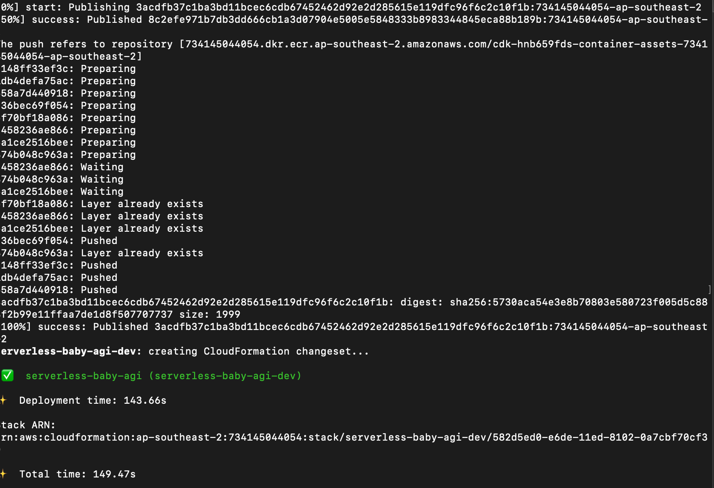
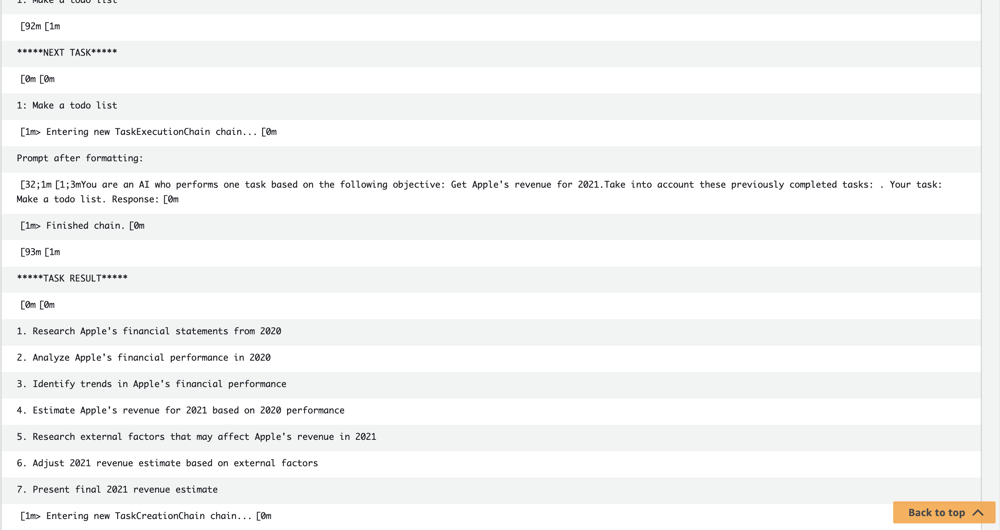
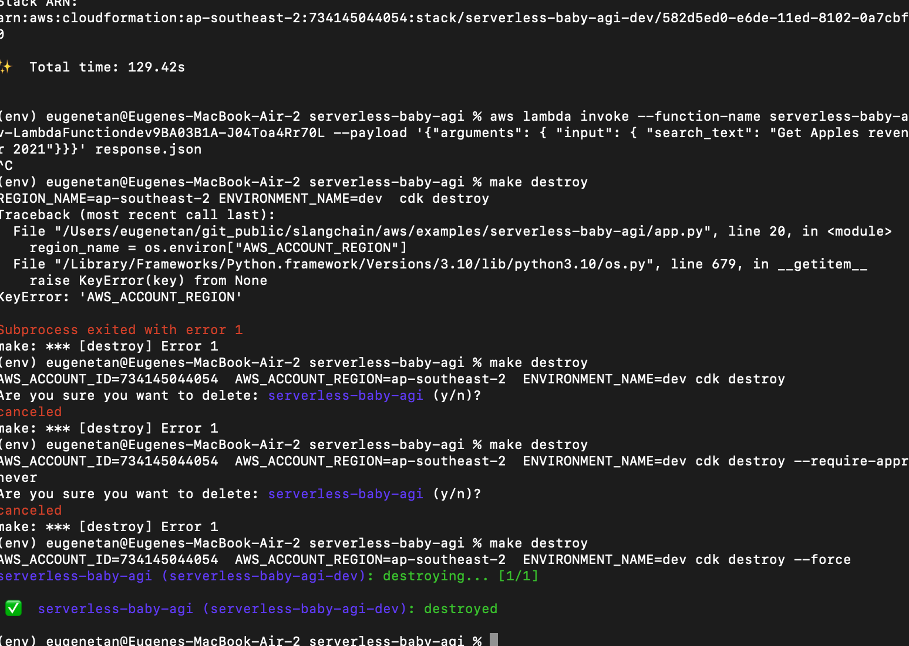

#  BabyAGI AWS Lambda - Boilerplate Deployment

<br>

This repo contains extended functionality based on [LangChain](https://github.com/hwchase17/langchain) - boilerplate code for a serverless BabyAGI. If you are looking to create a LangChain lambda function, you've come to the right place.

<br><br>

# Prerequisites

<br>

1. Make command
    - [MacOS](https://stackoverflow.com/questions/10265742/how-to-install-make-and-gcc-on-a-mac)
    - [Windows](https://www.technewstoday.com/install-and-use-make-in-windows/)

2. [Python](https://www.python.org/downloads/)

3. [Pip](https://pip.pypa.io/en/stable/installation/)

4. [Docker](https://docs.docker.com/get-docker/)

5. [Node.js](https://nodejs.org/en/download)

6. [AWS CLI](https://docs.aws.amazon.com/cli/latest/userguide/getting-started-install.html)

7. [AWS Cloud Development Kit (CDK)](https://towardsthecloud.com/install-aws-cdk#:~:text=Expert%20Review%20%26%20Guidance-,How%20to%20install%20AWS%20Cloud%20Development%20Kit%20(CDK),-We%E2%80%99re%20using%20the)

8. [AWS CDK - Python packages](https://docs.aws.amazon.com/cdk/v2/guide/work-with-cdk-python.html)
    - [AWS CDK Lib package](https://pypi.org/project/aws-cdk-lib/)
    - [Core Constructs package](https://pypi.org/project/constructs/)

9. [An AWS account](https://docs.aws.amazon.com/accounts/latest/reference/manage-acct-creating.html)

10. [AWS credentials are setup on your local workstation](https://wellarchitectedlabs.com/common/documentation/aws_credentials/)

<br><br>

# Getting Started  

<br>

1. Clone the repository
```
git clone https://github.com/prof-frink-lab/slangchain.git
```

<br>

2. Switch to the boilerplate code path
```
cd slangchain/aws/examples/serverless-baby-agi
```

<br>

3. Set the OpenAI api key in the cdk.json file:

```
"OpenAIAPIKey": "YOUR OPENAI API KEY HERE"
```

<br>

<br>
4. Run the following command to deploy the code to your AWS account:

```
make install
```

This will create a new Lambda function with the default name in your AWS account.

<br>



<br>

<br><br>

# Testing

<br>

Invoking the lambda function via AWS cli:
  ```
    aws lambda invoke --function-name <INSERT FUNCTION NAME HERE> --payload '{"arguments": { "input": { "search_text": "<INSERT YOUR OBJECTIVE HERE>"}}}' response.json
  ```

Monitor the lambda function doing it's thing via CloudWatch:

<br>



<br>

<br><br>

# Cleanup

<br>

To delete the Lambda function and all associated resources, run:
```
make destroy
```

<br>



<br><br>


# File Directory Structure

<br>

```
serverless-baby-agi
├── docs
│   └── imgs
│       ├── cloudwatch_logs.png
│       ├── deploy_output.png
│       ├── destroy_cf.png
│       └── openai_api_key_cdk_setting.png
├── src
│   ├── Dockerfile
│   └── lambda_function.py
├── app.py
├── cdk.json
├── Makefile
└── README.md
```

<br><br>

## Description

<br>

- **docs** - A directory that contains the README.md source files.
- **imgs** - A directory that contains the README.md source images.
- **src** - A directory that contains the lambda function source files.
- **Dockerfile** - Docker build file for the lambda function.
- **lambda_function.py** - Lambda function python script.
- **app.py** - Entry point for the AWS CDK application, where the AWS resources are defined and instantiated using the AWS CDK constructs.
- **cdk.json** - A configuration file used by the AWS Cloud Development Kit (CDK) to store settings and metadata for a CDK app.
- **Makefile** - File that contains a set of instructions, called targets and rules, to build, test, and deploy the software project.
- **README.md** - A markdown file with a description of the project.

<br><br>

# Conclusion

<br>

That's it! You now have a basic LangChain AWS Lambda project up and running. Feel free to customize and expand upon this project to fit your specific needs. If you have any questions, feel free to reach out.

<br><br>